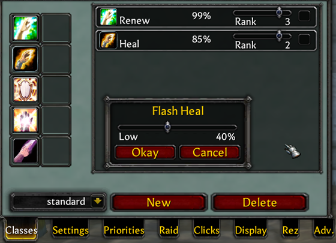
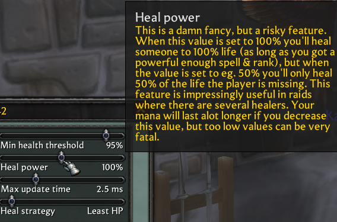
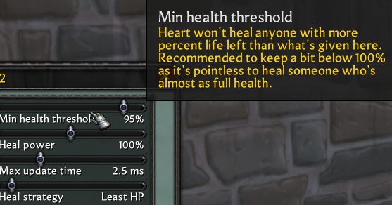
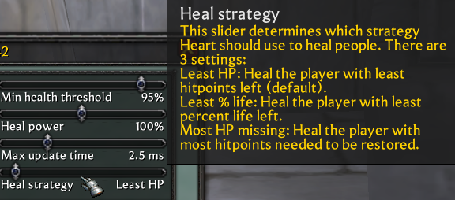
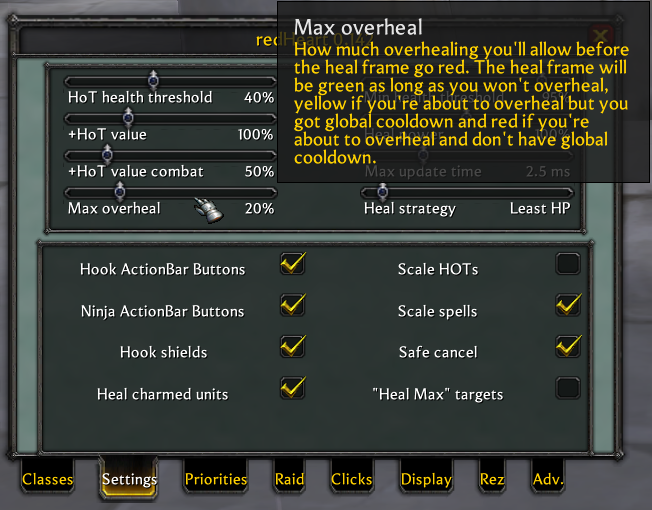
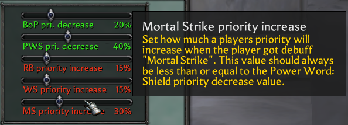
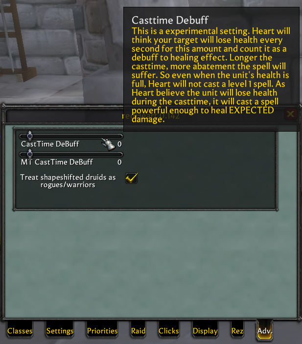
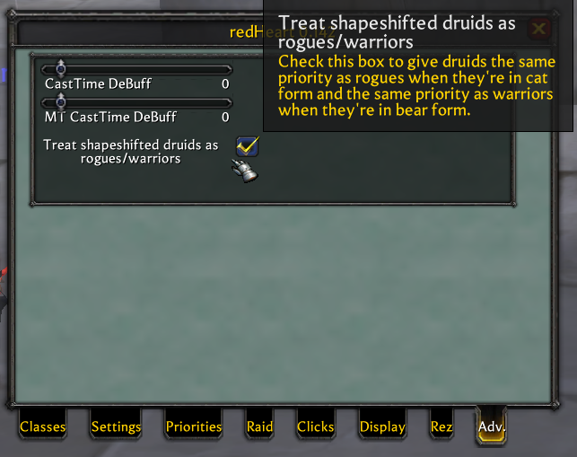

**redHeart**, or **Heart**, is a healing addon for WoW 1.12.

### **Introduction**  

Every healer can greatly benefit from Heart. Its Heal Current Bar displays the overhealing of your current spell and warns you when it exceeds a certain threshold. Heart heal bars show what nearby healers are doing.  

Its auto-healing algorithm is highly intelligent, precisely adjusting healing priorities for each class—even increasing priority when a target has Weakened Soul. With Heart, you don’t need to keep a party frame on-screen, yet it ensures everyone stays alive. Sometimes, it’s astonishing how Heart identifies the most injured teammate. Best of all, it minimizes overhealing by canceling unnecessary casts in time.  

Using Heart might make you "lazy"—it replaces most manual clicking for healers. Simply put, it’s a most advanced healing addon available.  

---

### **Quick Start**  
*(Default settings include presets for 4 classes, which may not be optimal, just for easy of use.)*  

When Heart is installed, there would be a heart icon next to the minimap. Left-click to toggle the option panel, right-click to toggle the button panel.

1. **Targeted Healing**:  
   - When targeting a teammate, click a healing spell on your action bar. Heart automatically adjusts the spell’s rank to heal *exactly* the missing HP, minimizing overheal.  
   - Spam-click the spell: Heart cancels the cast if overheal exceeds 20%; otherwise, it proceeds.  

2. **Untargeted Healing**:  
   - Click the **standard** button on Heart’s panel to auto-select the most injured nearby ally and cast an appropriate spell. Spam-clicking cancels overheals and picks a new target.  
   - *Pro Tip*: Bind `/script Heart_HealMostWounded("standard")` to a key—spam it to heal the entire group effortlessly (great for trash mob encounters!).  

3. **Tank Priority**:  
   - Use the **Tank** button to mark the Main Tank (MT). Allowing you to freely observe what others are doing while still automatically healing the MT when clicking the healing button.

4. **Cross-Healer Awareness**:  
   - If multiple players use Heart, you can see other healers’ heal bars! Even non-healers can monitor incoming heals to decide whether to use potions.  
   - **Monitor**: A list method providing a clearer way to track healing progress.

5. **Advanced Features**:  
   - **Click-Heal**: Enable Click Healing to heal by clicking unit frames.  
   - **Custom Macros**: You can make macro commands to customize the functionality you need. If you're an expert, you can even use them to write complex programs:
     ```lua
     /script Heart_HealMostWounded("standard") 
     ```
     This will heal the most injured teammate using the "standard" combination, so just spam this key for convenience.
     ```lua
     /script Heart_ActionHeal("standard") 
     ```
     This is equivalent to pressing the **standard** button on the panel, following a complex set of selection rules, considering MT, hotkeys, etc.

   - **Linear Priority System**: Graphical, adjustable, and non-restrictive. Limit max spell ranks to reduce overheal.
    
     

---

### **Key Customization Options**  
- **Heal Power**:
  - Heal 50% of missing HP (avoids overlap with other healers; ideal for Druids).  
  - Heal 150% for safety (intentional overheal).  
  
  
- **Min Health Threshold**: Minimum HP % to trigger a heal.
  
  
- **Priority Modes**: 3 preset strategies.
  
  
- **Overheal Alerts**: Cast bar color changes when overhealing.

  
- **Dynamic Priority Adjustments**:  
  - Factors like Recently Bandaged, Mortal Strike, or Shields alter priority.

     
  - Customize raid-wide priorities.  
- **Cast Time Compensation**:  
  - Predicts HP loss per second. For a 3-second Healing Touch, the heal amount = current HP loss + (3 × HP loss per second).

    
- **Class-Specific Logic**:  
  - Druids in Bear Form are prioritized like Warriors.

    
- **Save/Load Strategies**: Switch presets for different meet different roles.  